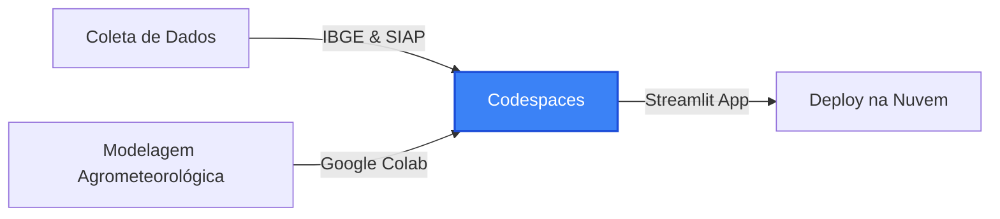

# 🌾 Cálculo Intercultural: Conexões Agrícolas & Climáticas Brasil-México

Este repositório contém o projeto acadêmico desenvolvido para a disciplina de **Cálculo** dentro do **Projeto Colaborativo Internacional "Cálculo intercultural: construyendo conexiones Brasil y México"** (parceria entre a **Fatec Ourinhos** e a **Universidad Anáhuac Puebla**, México).

O objetivo principal é aplicar conceitos de **Cálculo Diferencial, Integral e Equações Diferenciais Ordinárias (EDOs)** para modelar, comparar e simular o impacto de anomalias climáticas (secas extremas e estresse térmico) na produtividade de culturas estratégicas de ambos os países (Soja, Milho, Feijão e Café) entre 2000 e 2024.

---

## ☁️ Filosofia do Projeto: 100% na Nuvem

Este projeto foi desenhado sob a premissa de **inclusão digital e acessibilidade**, sendo executado **inteiramente de forma virtual e na nuvem**. Qualquer estudante consegue clonar, tratar dados, programar as equações matemáticas e colocar o dashboard online diretamente pelo navegador (Google Chrome, Edge, Safari), sem a necessidade de instalar programas localmente ou de dispor de um computador pessoal potente.



---

## 🧮 Aplicação Prática dos Conceitos de Cálculo

### 1. Cálculo Integral: Acumulação de Calor (GDD)
Medição do calor útil acumulado (Graus-Dia Acumulados) durante o ciclo vegetativo de 120 dias usando a **integral definida** da temperatura que excede a temperatura base da planta:

* **Equação**: GDD = Integral de t_inicio a t_fim de [ max(0, T(t) - T_base) ] dt
* **Implementação Numérica**: O algoritmo aproxima o valor da integral utilizando a **Regra de Simpson** sobre dados diários de temperatura coletados de institutos de meteorologia (como o INMET no Brasil).

### 2. Cálculo Diferencial: Otimização da Produtividade
Ajustamos a produtividade histórica (Y) em relação ao índice de seca (SPEI) através de uma curva polinomial de segundo grau:

* **Equação da Curva**: Y(SPEI) = a * SPEI^2 + b * SPEI + c
* **Ponto Crítico (Primeira Derivada)**: dY/dSPEI = 2a * SPEI + b = 0  =>  **SPEI\*** = -b / (2a)
* **Teste de Concavidade (Segunda Derivada)**: d2Y/dSPEI2 = 2a. Como o coeficiente quadrático "a" é negativo (a < 0), a concavidade é voltada para baixo, provando que o ponto crítico encontrado representa o rendimento máximo possível.

### 3. Equações Diferenciais Ordinárias (EDOs): Crescimento Vegetal
Simulamos o crescimento diário de biomassa da planta (Y) no tempo (t) usando a **Equação Diferencial Logística de Verhulst** acoplada ao estresse de seca:

* **Equação de Crescimento (EDO)**: dY/dt = r(SPEI) * Y * (1 - Y / K(SPEI))
* **Resolução Numérica**: Resolvida passo a passo via **Método de Euler** no código. A taxa intrínseca de crescimento "r" e a capacidade de suporte "K" (teto produtivo) diminuem proporcionalmente à intensidade da seca (SPEI negativo).

---

## 🖥️ Estrutura da Interface (Dashboard Streamlit)

A aplicação visual permite que qualquer usuário experimente a matemática de forma aplicada:
* **Aba 1: Histórico Comparativo**: Comparação visual das safras de Brasil e México.
* **Aba 2: Roteiro Agrometeorológico**: Dados climáticos e de NDVI em gráficos temporais.
* **Aba 3: Otimização Diferencial**: Gráfico interativo com a reta tangente no ponto de derivada nula ($\frac{dY}{dSPEI} = 0$).
* **Aba 4: Simulador da EDO**: Sliders interativos para ajustar a seca ($SPEI$) e ver a curva de crescimento da planta se achatar ou acelerar instantaneamente.

---

## 🚀 Como Executar este Projeto na Nuvem (Passo a Passo)

### Passo 1: Executando o Ambiente de Programação
1. No seu GitHub, clique no botão **Code** -> aba **Codespaces** -> **Create codespace on main**.
2. Aguarde o editor carregar no navegador e abra o terminal integrado do Codespaces.

### Passo 2: Instalar as Dependências
No terminal do Codespaces, digite:
```bash
pip install -r requirements.txt
```

### Passo 3: Rodar a Interface Web localmente na Nuvem
Execute no terminal:
```bash
streamlit run src/dashboard/app.py
```
O Codespaces detectará a porta e exibirá uma mensagem pop-up no canto inferior direito. Clique em **"Open in Browser"** para ver seu dashboard rodando.

### Passo 4: Fazer o Deploy (Publicar no Streamlit Cloud)
1. Salve as alterações e envie ao repositório (`git add .`, `git commit -m "...", git push`).
2. Acesse [share.streamlit.io](https://share.streamlit.io) e conecte com seu GitHub.
3. Clique em **"New app"**, selecione este repositório e o arquivo do app.
4. Clique em **"Deploy"** e envie o link final gerado para o professor!
